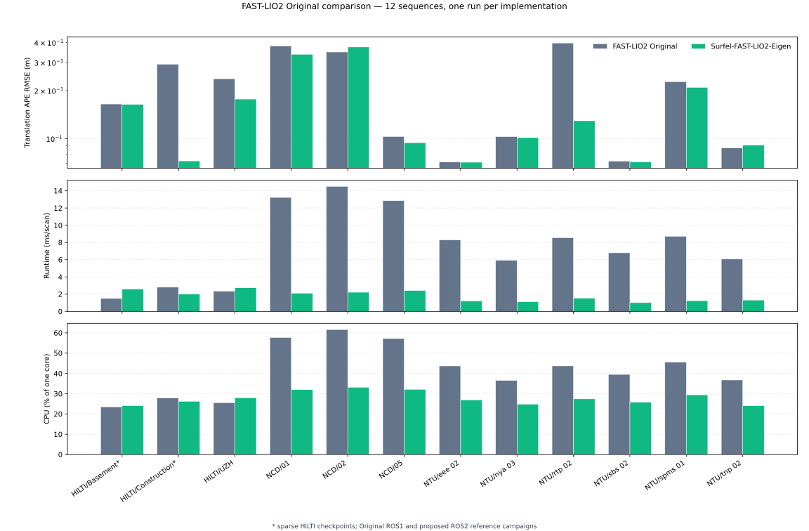

<h1 align="center"><span>Surfel-FAST-LIO2-Eigen</span></h1>

+ This repository provides an Eigen-only FAST-LIO2 state estimator with a two-level hierarchical voxel Surfel map from [Surfel-LIO](https://github.com/93won/lidar_inertial_odometry); the benchmark below measures substantially lower runtime than FAST-LIO2 Original on the tested sequences.
  + MTK, `MTK_BUILD_MANIFOLD`, IKFoM, ikd-Tree, and OpenMP are not used.
  + Hierarchical Surfel map with selectable dense or oneTBB concurrent-hash backends selectable once at startup.
  + Explicit fixed-size Eigen implementation of the 17-dimensional error state, including the SO(3) perturbation and two-dimensional gravity error.
+ The proposed-method rows use the corrected right-error SO(3) covariance propagation, complete
  S² gravity transport, final S² covariance reset, and explicit first synchronized-scan discard.
+ Initial-IMU gravity alignment published as `map_frame → odometry_frame` without changing the estimator state or map.
+ A ROS-independent C++ core is shared by separate ROS1 and ROS2 wrappers.

<p align="center">
  
</p>

<br>

## FAST-LIO2 Original comparison

+ FAST-LIO2 Original values come from the one-run upstream ROS1 reference campaign; the proposed
  columns use the current corrected ROS2 results reported in this README. NCD and NTU used the same
  physical sensor streams. HILTI used Mid70 for Original and Ouster for the proposed method, so
  those three rows are cross-sensor dataset references rather than controlled comparisons.

| Sequence | FAST-LIO2 Original APE RMSE (m) | Surfel-FAST-LIO2-Eigen APE RMSE (m) | Original runtime (ms/scan) | Surfel-FAST-LIO2-Eigen runtime (ms/scan) | Original CPU (% one core) | Surfel-FAST-LIO2-Eigen CPU (% one core) |
| --- | ---: | ---: | ---: | ---: | ---: | ---: |
| `HILTI Basement_1 (Mid70 / Ouster)` | 0.1646 | **0.1635** | **1.661** | 2.792 | **23.49** | 24.07 |
| `HILTI Construction_Site_2 (Mid70 / Ouster)` | 0.2922 | **0.0724** | 3.348 | **2.356** | 27.89 | **26.24** |
| `HILTI uzh_tracking_area_run2 (Mid70 / Ouster)` | 0.2368 | **0.1767** | **2.742** | 3.155 | **25.58** | 27.93 |
| `Newer College 01_short` | 0.3800 | **0.3371** | 14.264 | **3.525** | 57.68 | **32.00** |
| `Newer College 02_long` | **0.3485** | 0.3745 | 15.543 | **3.587** | 61.64 | **33.16** |
| `Newer College 05_quad` | 0.1030 | **0.0942** | 13.889 | **3.274** | 57.19 | **32.17** |
| `NTU VIRAL eee_02` | 0.0713 | **0.0711** | 9.248 | **2.326** | 43.69 | **26.92** |
| `NTU VIRAL nya_03` | 0.1029 | **0.1014** | 6.508 | **1.829** | 36.50 | **24.78** |
| `NTU VIRAL rtp_02` | 0.3966 | **0.1292** | 9.424 | **2.614** | 43.70 | **27.44** |
| `NTU VIRAL sbs_02` | 0.0723 | **0.0714** | 7.598 | **1.949** | 39.51 | **25.77** |
| `NTU VIRAL spms_01` | 0.2271 | **0.2092** | 10.051 | **3.367** | 45.53 | **29.44** |
| `NTU VIRAL tnp_02` | **0.0873** | 0.0909 | 6.673 | **2.175** | 36.75 | **24.04** |

<br>

## Dependencies
+ `ROS1 Noetic` or `ROS2 Jazzy`
+ `C++` >= 17
+ `Eigen3`
+ `PCL` >= 1.8
+ `oneTBB`
+ `livox_ros_driver` for ROS1 Livox messages or `livox_ros_driver2` for ROS2 Livox messages

<br>

## How to install
+ Clone and install as follows:
  ```bash
  cd ~/<your_ros2_workspace>/src
  git clone https://github.com/engcang/surfel-fast-lio2-eigen.git

  # ROS2
  cd ~/<your_ros2_workspace>
  source /opt/ros/jazzy/setup.bash
  colcon build --packages-select surfel_fast_lio2_eigen --cmake-args -DCMAKE_BUILD_TYPE=Release
  source install/setup.bash

  # ROS1
  cd ~/<your_catkin_workspace>
  source /opt/ros/noetic/setup.bash
  catkin build surfel_fast_lio2_eigen --cmake-args -DCMAKE_BUILD_TYPE=Release
  source devel/setup.bash
  ```

<br>

## How to use
+ Run the ROS2 node with
  ```bash
  ros2 launch surfel_fast_lio2_eigen run.launch.py \
      config_file:=mid360.yaml \
      rviz:=false
  ```

+ Run the ROS1 node with
  ```bash
  roslaunch surfel_fast_lio2_eigen run.launch \
      config_file:=mid360.yaml \
      rviz:=false
  ```

+ Select the Surfel map backend in the config YAML before startup.
  + `false` selects the dense backend and is recommended for CPU-constrained onboard computers.
  + `true` selects the oneTBB concurrent-hash backend when lower map-update runtime is worth additional CPU use.
    ```yaml
    surfel:
      use_concurrent_hash_map: false
    ```

<br>

### ● Troubleshooting
+ Start the node before bag playback and allow ROS2 DDS discovery to finish; dropping the first LiDAR or IMU messages can change initialization.
+ The LiDAR-to-IMU translation and rotation parameters require exactly 3 and 9 values, respectively.
+ Use the sensor-specific YAML as a starting point. Avia keeps a larger local map because of its longer measurement range.
+ The HILTI `uzh_tracking_area_run2` recording used in validation requires a `0.3 s` input start offset because its initial segment produces an unsuitable first Surfel map.

<br>

## LICENSE
+ This repository is a derivative of [FAST-LIO2](https://github.com/hku-mars/FAST_LIO). The repository as a whole is therefore distributed under GNU GPL version 2; source-file notices inherited from FAST-LIO2 and LOAM are retained.
+ The hierarchical voxel Surfel mapping design follows [Surfel-LIO](https://github.com/93won/lidar_inertial_odometry) and its associated paper.
+ `ankerl::unordered_dense` is vendored under the MIT License. Eigen, PCL, oneTBB, ROS, and Livox driver components remain under their respective licenses.
+ You may use, study, modify, and redistribute it under the GPL-2.0-only terms. Distributed modifications must preserve applicable copyright and license notices and remain GPL-compatible.
